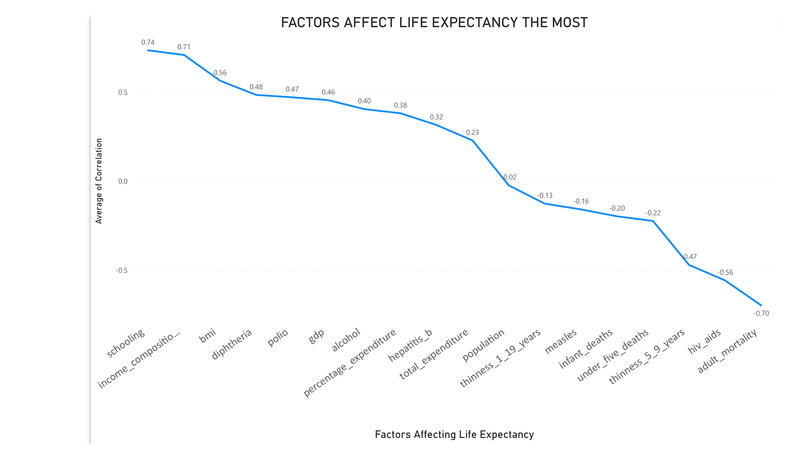
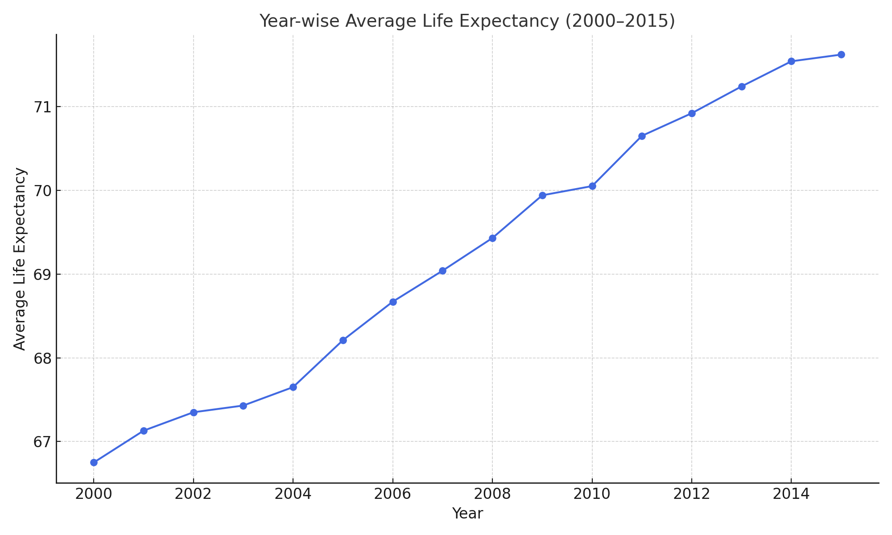
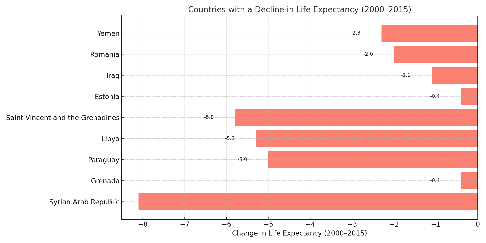

# 🌍 Global Life Expectancy Analysis (SQL Case Study)

> 📁 **Project Type**: Portfolio Project  
> 🧠 **Skills Demonstrated**: Advanced SQL, Data Cleaning, Analytical Thinking, Data Visualization  
> 🧰 **Tools Used**: PostgreSQL, DBeaver, Excel / Power BI, ChatGPT  
> ⏱️ **Time Frame**: 2000–2015 (WHO Dataset)

---

## 🚀 Project Overview

In this project, I used SQL to analyze a global dataset on life expectancy and health indicators across countries over time. This analysis answers **key business questions** relevant to public health strategy, policy-making, and global development. 

With structured queries, data exploration, and compelling visualizations, I identified what drives life expectancy, compared developed vs developing countries, evaluated the impact of GDP and healthcare spending, and tracked public health trends over time.

---

## 🧩 Business Questions & Insights

### 1️⃣ What Factors Affect Life Expectancy the Most?
**Objective**: Understand which health or economic metrics have the strongest correlation with life expectancy.

- 🖥️ **Query**: [factors_affecting_life_expectancy_the_most.sql](Scripts/factors_affecting_life_expectancy_the_most.sql)
- 📈 **Visualization**: 

**Key Insights**:
- 📊 Key Findings:

- **Positive Correlation**: 
  - **Schooling** ,**income of composition of resources**( Healthcare ,Education
Nutritious food, Clean water and sanitation)

  - **Diphtheria (%)** and **Polio (%)** immunization rates are strong positive indicators — countries with better childhood vaccination coverage tend to have longer life expectancy.
  - **Alcohol consumption** also shows a positive correlation, likely because moderate alcohol intake is more common in developed countries, which have higher life expectancy due to better healthcare, not because alcohol directly improves health.

- **Negative Correlation**:
  - **HIV/AIDS prevalence**, **adult mortality**, and **infant deaths** strongly reduce life expectancy.

> 💡 Interpretation Tip:
Some variables (like alcohol) correlate positively not due to direct health benefits, but because they are **proxies for socioeconomic development**.

> #### 💡 Countries should prioritize combating HIV/AIDS and investing in education and healthcare access to improve life expectancy.

---

## 2️⃣ How Does Life Expectancy Vary Between Developed and Developing Countries?
**Objective**: Compare average life expectancy between country types.

- 🖥️ **Query**: [life_expectancy_between_developed_and_developing_Countries.sql](Scripts/life_expectancy_between_developed_and_developing-countries.sql)
- 📈 **Visualization**: 

**Key Insights**:
- Developed nations live **10+ years longer** on average.
- Developing nations show **high variability**, indicating health inequality.

> 💡 Global health initiatives should focus on improving baseline conditions in developing countries.

---

### 3️⃣ Is Life Expectancy Increasing Over Time Globally?
**Objective**: Track whether life expectancy is improving worldwide.

- 🖥️ **Query**:[life_expectancy_trend.sql](Scripts/life_expectancy_over_the_years.sql)
- 📈 **Visualization**: 

**Key Insights**:
- **Upward trend** globally from 2000–2015.
- **Slower gains** in lower-income countries.

> 💡 There is progress, but equity and access must be addressed to sustain it.

---

### 4️⃣ Which Countries Have the Highest and Lowest Life Expectancy?
**Objective**: Identify extreme performers for benchmarking.

- 🖥️ **Query**:[high_life_exp_countries,sql](Scripts/high_life_exp_countries.sql),
[low life exp countries.sql](Scripts/lowest_life_exp-countries.sql)
- 📈 **Visualization**: ,

**Key Insights**:
- **Top Performers**: Japan, Sweden, Iceland
- **Lowest**: Sierra Leone, Lesotho, Central African Republic 

> 💡 High life expectancy correlates with access to clean water, universal healthcare, and education.
>💡 Low life expectancy correlates with limited access to clean water, inadequate healthcare, and lack of education.

---

### 5️⃣ Cluster Countries by Similar Health Profiles
**Objective**: Group countries with similar health systems and risk factors.

- 🖥️ **Query**:[health_profile_clusters.sq](Scripts/cluster_countries_based_on_diff_health_indicators.sql)
- 📈 **Visualization**: 

**Key Insights**:
- 3–4 clusters: high-income/high-health, mid-income/stable, low-income/at-risk
- Shared traits within clusters help drive region-specific strategy.

> 💡 Tailored global health programs can be more effective than one-size-fits-all solutions.

---

### 6️⃣ Link Between Healthcare Spending and Life Expectancy
**Objective**: Test how strongly expenditure influences life expectancy.

- 🖥️ **Query**:[spending_vs_life_expectancy.sql](Scripts/relation_health_spending_and_life_expe.sql)
- 📈 **Visualization**: 

**Key Insights**:
 1. Total Expenditure vs Life Expectancy
Both developed (0.35) and developing (0.34) countries show a moderate positive correlation.

💬 This suggests that spending more money on health care does tend to improve life expectancy somewhat, but it's not a strong effect.

✅ 2. Percentage Expenditure (% of GDP) vs Life Expectancy
Very low correlation for both groups (0.07 and 0.11).

💬 Spending a higher share of GDP on healthcare doesn't necessarily result in higher life expectancy — possibly due to inefficiency or poor distribution.

✅ 3. GDP vs Life Expectancy
Slightly higher correlation (0.34–0.37) than the other two.

💬 Wealthier countries tend to have longer life expectancy — but again, it’s not a very strong relationship.

> 💡 Smart allocation of healthcare budgets yields better outcomes than high spending alone.

---

### 7️⃣ Countries With Declining Life Expectancy & Risk Factors
**Objective**: Spot at-risk countries and associated risk indicators.

- 🖥️ **Query**: [declining _life_exp_over_time](<Scripts/declining _life_exp_over_time.sql>)
- 📈 **Visualization**:

**Key Insights**:
- Decline mainly in sub-Saharan Africa due to HIV, war, or underfunded health systems.

> 💡 Early intervention and global aid are critical for reversing negative health trends.

---

### 8️⃣ Track Health Progress Over Time by Country
**Objective**: Assess health development on a per-country basis.

- 🖥️ **Query**:[health_progress_over_time_by_country](Scripts/health_progress_over_time_by_country.sql)
- 📈 **Visualization**: 

**Key Insights**:
- **Success Stories**: Zimbabwe,Eritrea (education + vaccination efforts)
- **Flat or Declining**: Despite GDP growth, some countries struggle with systemic healthcare issues

> 💡 Sustainable development requires a multi-sector approach—not just economic growth.

---

## 💼 Strategic Takeaways

🎯 **Policy Makers & NGOs**  
- Target spending toward low-performing clusters  
- Promote disease prevention programs and education  
- Leverage success models from outperforming countries

📊 **Data Analysts & Stakeholders**  
- Use clustering for resource allocation  
- Monitor year-over-year country-level improvements  
- Track spending efficiency instead of just volume

---

## 🧪 Technical Summary

| Component         | Details                          |
|------------------|----------------------------------|
| **Language**      | SQL (PostgreSQL)                |
| **Platform**      | DBeaver, PGAdmin                |
| **Dataset**       | WHO Life Expectancy (2000–2015) |
| **Visualization** | ChatGPT, Excel, Power Bi        |

